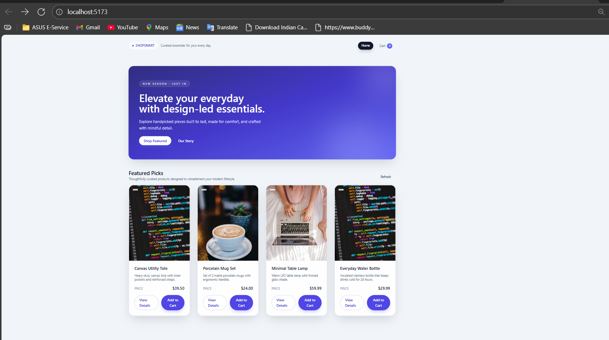

# 🛍️ E-Commerce Web App

A modern e-commerce application with a React frontend and a Node.js + Express + MongoDB backend. This project demonstrates product listing/detail pages, a responsive UI, and cart management with a REST API.

---

## Table of contents
- [Project Overview](#project-overview)
- [Tech Stack](#tech-stack)
- [Architecture](#architecture)
- [Features](#features)
- [Getting Started](#getting-started)
  - [Prerequisites](#prerequisites)
  - [Environment Variables](#environment-variables)
  - [Frontend Setup](#frontend-setup)
  - [Backend Setup](#backend-setup)
  - [Seeding Data](#seeding-data)
- [API Reference](#api-reference)
- [Screenshots](#screenshots)
- [Project Structure](#project-structure)
- [Development Tips](#development-tips)
- [Future Improvements](#future-improvements)
- [Contributing](#contributing)
- [License & Contact](#license--contact)

---

## Project overview
This repository contains:
- A React 18 frontend (Vite) with Redux Toolkit and Tailwind CSS for UI and client-side cart state.
- A Node.js + Express backend using Mongoose to interact with MongoDB (Atlas recommended).
- REST endpoints to list products and manage a user cart.

---

## Tech stack
- Frontend: React 18, React Router, Redux Toolkit, Tailwind CSS, Axios, Vite
- Backend: Node.js 20+, Express 4, Mongoose 8, express-validator, dotenv, cors, morgan
- Database: MongoDB Atlas (Mongoose ODM)
- Tooling: ESLint, Nodemon, PostCSS, Tailwind CLI, npm scripts

---

## Architecture
Frontend ↔ REST API ↔ Backend (Express → Controllers → Services → Mongoose models) ↔ MongoDB Atlas

Key layers:
- Frontend: routes, store (cart slice), services (API clients)
- Backend: routes, controllers, services, models (Product, User, Cart), middleware (validation, errors)

---

## Features
- Responsive product listing and product detail pages
- Client-side cart with add/update/remove actions (Redux Toolkit)
- RESTful backend with layered architecture
- Mongoose models with validation
- Input validation and error middleware
- Seed scripts to populate product data

---

## Getting started

### Prerequisites
- Node.js >= 18
- npm >= 8
- MongoDB Atlas cluster (or a local MongoDB instance)

### Environment variables
Create `.env` files (do not commit them) or export variables in your shell.

Backend `.env` (example)
```
PORT=4000
MONGODB_URI=mongodb+srv://<user>:<password>@cluster0.mongodb.net/ecommerce
NODE_ENV=development
SEED_SAMPLE_COUNT=12
```

Frontend `.env` (optional)
```
VITE_API_BASE_URL=http://localhost:4000/api
```
Note: During development the frontend usually proxies `/api` to `http://localhost:4000` via Vite config.

---

## Frontend setup
```bash
cd frontend
npm install
npm run dev     # starts Vite dev server (default http://localhost:5173)
# build for production:
npm run build
npm run preview # serve built assets locally
```

---

## Backend setup
```bash
cd backend
npm install
npm run seed    # populate baseline products (uses MONGODB_URI)
npm run dev     # start Express with nodemon (default port 4000)
# or
npm start       # start server without nodemon
```

### MongoDB connection checklist
1. Create an Atlas cluster or run a local MongoDB instance.
2. Whitelist your IP (or use 0.0.0.0/0 for development).
3. Create a DB user and password.
4. Place the connection string into `MONGODB_URI` in the backend `.env`.
5. Start the backend and watch the logs for a successful connection message.

---

## Seeding data
- `npm run seed` in the backend will insert a curated set of products. Files involved: `backend/src/seed.js` or similar.
- For extended product seeding: `npm run seed:products` (if implemented).

---

## API reference
Base URL: `http://localhost:4000/api`

Common headers:
- `Content-Type: application/json`
- `x-user-id` (optional) — used to simulate a user identity for cart endpoints

Endpoints:
- GET `/api/products` — list all products
- GET `/api/products/:productId` — product details by ID
- GET `/api/cart` — retrieve current user cart
- POST `/api/cart/items` — add item to cart
  - Body: `{ "productId": "<mongo-id>", "quantity": 2 }`
- PUT `/api/cart/items/:productId` — update cart item quantity
  - Body: `{ "quantity": 3 }`
- DELETE `/api/cart/items/:productId` — remove an item from cart
- DELETE `/api/cart` — clear the cart

Sample curl for adding to cart:
```bash
curl -X POST http://localhost:4000/api/cart/items \
  -H "Content-Type: application/json" \
  -H "x-user-id: demo-user" \
  -d '{"productId": "<mongo-id>", "quantity": 2"}'
```

---

## Screenshots
I added example image references here so you can display output screenshots in the README. Place your screenshot files in docs/assets/screenshots/ (or change the paths below to match your chosen directory).

Single image (full width):
```markdown

```

Thumbnail that links to full-size (recommended for large images):
```markdown
[](docs/assets/screenshots/product-page.png)
```

Three example images with captions:


Notes:
- Filenames used above (placeholders) — homepage.png, product-page.png, product-page-thumb.png, cart.png
- Recommended directory: docs/assets/screenshots/
- If your images are large, consider using Git LFS or compressing to WebP/JPEG.
- Use descriptive alt text for accessibility.

Quick example you can paste at the exact line you mention (line ~211):
```markdown
## Output screenshots

Below are screenshots of the application in the running state. Click thumbnails to view full-size images.

[](/docs/assets/screenshots/homepage.png)
[](/docs/assets/screenshots/product-page.png)
[](/docs/assets/screenshots/cart.png)
```

---

## Project structure (high-level)
- frontend/
  - src/
    - components/
    - pages/
    - store/ (Redux slices, e.g., cart)
    - services/ (API clients)
    - App.jsx, main.jsx
- backend/
  - src/
    - controllers/
    - routes/
    - services/
    - models/ (Product, User, Cart)
    - middlewares/ (validation, error handling)
    - seed.js or scripts/seedProducts.js
  - server.js or app.js
- docs/assets/screenshots/  # suggested place for your screenshots
- README.md
- package.json (root / per package)

---

## Development tips
- Use `x-user-id` header to simulate users when testing cart endpoints.
- Keep sensitive credentials out of committed files; use `.env` and .gitignore.
- Run frontend and backend concurrently in separate terminals during development.
- Use Postman or curl to test API endpoints while building frontend features.

---

## Future improvements
- Authentication & authorization (JWT)
- Persist cart to MongoDB for multi-device sync
- Product search, filters, and sorting
- Inventory management and order/checkout flows
- Payment gateway integration
- Automated tests (unit/integration) and CI
- Asset CDN and caching, internationalization, multi-currency support

---

## Contributing
Contributions are welcome! Suggested workflow:
1. Fork the repo
2. Create a branch: `git checkout -b feat/your-feature`
3. Make changes and add tests where appropriate
4. Open a pull request describing the change

Please include clear PR descriptions and link any related issues.

---

## License & contact
- License: (add your license here — e.g., MIT)
- Maintainer: Rameshkn04
- Questions or suggestions: open an issue or submit a PR

---

Happy hacking!

